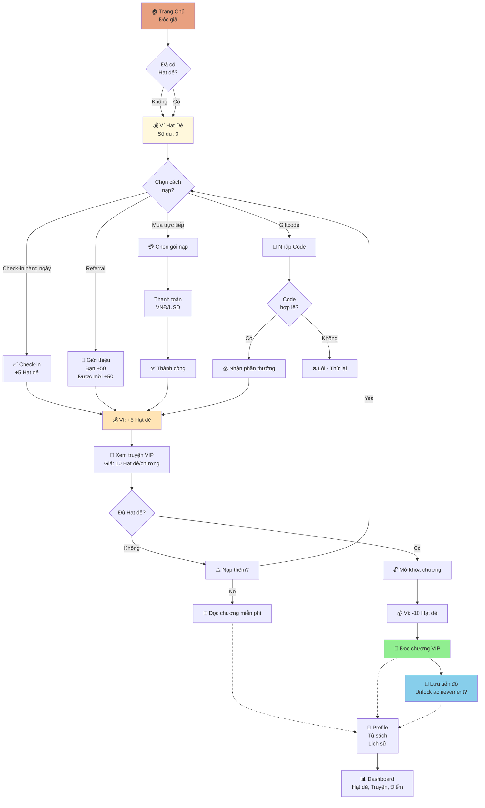
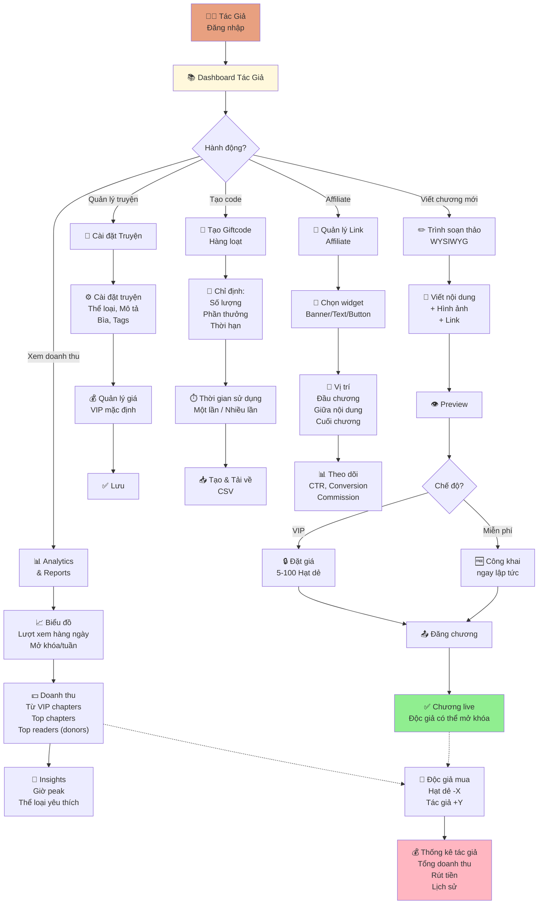
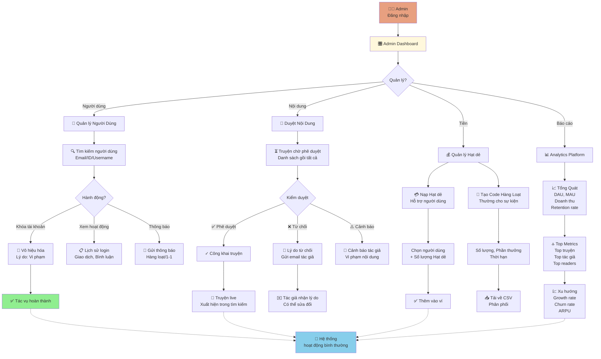
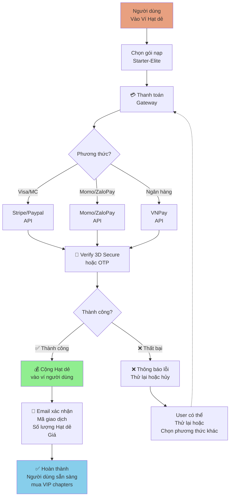
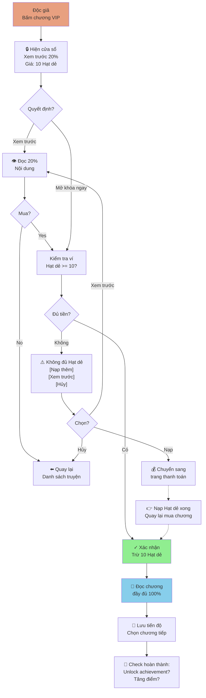
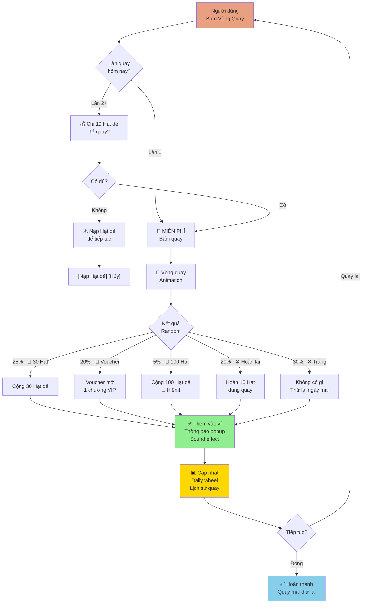
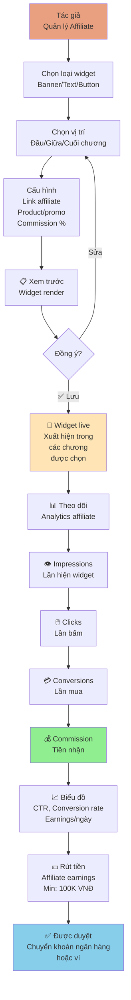
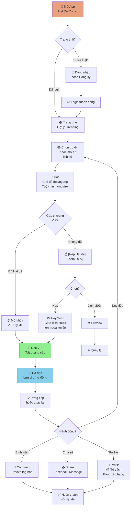

# User Flow & Architecture Diagrams
## Nền Tảng Hạt Dẻ Comic

---

## 📊 1. User Flow: Nạp Hạt Dẻ → Tiêu Dùng → Đọc VIP

---

## 👤 2. User Flow: Creator (Tác Giả) - Quản Lý Truyện & Doanh Thu

---

## 🛠️ 3. User Flow: Admin - Quản Lý Platform

---

## 🎯 4. Payment Flow - Nạp Hạt Dẻ (Trình Tự Chi Tiết)

---

## 💎 5. Luồng Mua Chương VIP - Paywall

---

## 🎮 6. Gamification Flow - Vòng Quay May Mắn

---

## 🔗 7. Affiliate Marketing Flow - Tác Giả & Admin

---

## 📱 8. Mobile App - Reading Experience (Optional PWA/Native)

