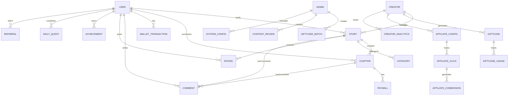

# Database Schema & Architecture
## Hạt Dẻ Comic Platform

---

## 📊 1. Sơ Đồ ER (Entity Relationship Diagram)



---

## 🗄️ 2. Bảng Chi Tiết (Table Schema)

### 2.1 Bảng USER (Người Dùng)

```sql
CREATE TABLE users (
    id BIGINT PRIMARY KEY AUTO_INCREMENT,
    username VARCHAR(50) UNIQUE NOT NULL,
    email VARCHAR(120) UNIQUE NOT NULL,
    password_hash VARCHAR(255) NOT NULL,
    
    -- Profile
    display_name VARCHAR(100),
    avatar_url VARCHAR(500),
    bio TEXT,
    
    -- Account status
    status ENUM('active', 'inactive', 'suspended', 'deleted') DEFAULT 'active',
    email_verified BOOLEAN DEFAULT FALSE,
    is_creator BOOLEAN DEFAULT FALSE,
    is_admin BOOLEAN DEFAULT FALSE,
    
    -- Security
    two_factor_enabled BOOLEAN DEFAULT FALSE,
    two_factor_secret VARCHAR(255),
    last_login TIMESTAMP,
    last_ip_address VARCHAR(45),
    
    -- Reading preferences
    reading_font VARCHAR(50) DEFAULT 'serif',
    reading_font_size INT DEFAULT 16,
    reading_line_height INT DEFAULT 150,
    dark_mode BOOLEAN DEFAULT FALSE,
    
    -- Metadata
    created_at TIMESTAMP DEFAULT CURRENT_TIMESTAMP,
    updated_at TIMESTAMP DEFAULT CURRENT_TIMESTAMP ON UPDATE CURRENT_TIMESTAMP,
    deleted_at TIMESTAMP NULL,
    
    INDEX idx_email (email),
    INDEX idx_username (username),
    INDEX idx_status (status),
    INDEX idx_created_at (created_at)
);
```

### 2.2 Bảng WALLET (Ví Hạt Dẻ)

```sql
CREATE TABLE wallet (
    id BIGINT PRIMARY KEY AUTO_INCREMENT,
    user_id BIGINT NOT NULL UNIQUE,
    balance DECIMAL(18, 2) DEFAULT 0.00,
    total_earned DECIMAL(18, 2) DEFAULT 0.00,
    total_spent DECIMAL(18, 2) DEFAULT 0.00,
    
    -- Freeze balance khi chờ xác nhận giao dịch
    frozen_balance DECIMAL(18, 2) DEFAULT 0.00,
    
    updated_at TIMESTAMP DEFAULT CURRENT_TIMESTAMP ON UPDATE CURRENT_TIMESTAMP,
    
    FOREIGN KEY (user_id) REFERENCES users(id) ON DELETE CASCADE,
    INDEX idx_user_id (user_id)
);
```

### 2.3 Bảng WALLET_TRANSACTION (Giao Dịch Ví)

```sql
CREATE TABLE wallet_transactions (
    id BIGINT PRIMARY KEY AUTO_INCREMENT,
    user_id BIGINT NOT NULL,
    
    -- Transaction type
    type ENUM('topup', 'spend', 'refund', 'bonus', 'referral', 'donation', 'gift') NOT NULL,
    amount DECIMAL(18, 2) NOT NULL,
    
    -- Liên quan đến chi tiết
    related_entity_type VARCHAR(50), -- 'chapter_purchase', 'daily_quest', 'affiliate', etc.
    related_entity_id BIGINT,
    
    -- Description
    description TEXT,
    
    -- Status
    status ENUM('pending', 'completed', 'failed', 'refunded') DEFAULT 'pending',
    
    -- Payment method (for topup)
    payment_method VARCHAR(50), -- 'stripe', 'momo', 'zalopay', 'vnpay'
    external_transaction_id VARCHAR(255),
    
    created_at TIMESTAMP DEFAULT CURRENT_TIMESTAMP,
    completed_at TIMESTAMP NULL,
    
    FOREIGN KEY (user_id) REFERENCES users(id) ON DELETE CASCADE,
    INDEX idx_user_id (user_id),
    INDEX idx_type (type),
    INDEX idx_created_at (created_at),
    INDEX idx_status (status)
);
```

### 2.4 Bảng STORY (Truyện)

```sql
CREATE TABLE stories (
    id BIGINT PRIMARY KEY AUTO_INCREMENT,
    creator_id BIGINT NOT NULL,
    category_id INT NOT NULL,
    
    -- Content
    title VARCHAR(255) NOT NULL,
    slug VARCHAR(255) UNIQUE NOT NULL,
    description TEXT,
    cover_image_url VARCHAR(500),
    
    -- Status
    status ENUM('draft', 'pending_review', 'published', 'paused', 'deleted') DEFAULT 'draft',
    
    -- Stats
    view_count BIGINT DEFAULT 0,
    like_count INT DEFAULT 0,
    comment_count INT DEFAULT 0,
    rating_count INT DEFAULT 0,
    avg_rating DECIMAL(3, 2) DEFAULT 0,
    
    -- VIP config
    has_vip_chapters BOOLEAN DEFAULT FALSE,
    default_vip_price INT DEFAULT 10, -- Hạt dẻ per chapter
    
    -- Metadata
    tags VARCHAR(500), -- Comma-separated
    is_featured BOOLEAN DEFAULT FALSE,
    featured_until TIMESTAMP NULL,
    
    created_at TIMESTAMP DEFAULT CURRENT_TIMESTAMP,
    updated_at TIMESTAMP DEFAULT CURRENT_TIMESTAMP ON UPDATE CURRENT_TIMESTAMP,
    published_at TIMESTAMP NULL,
    deleted_at TIMESTAMP NULL,
    
    FOREIGN KEY (creator_id) REFERENCES users(id) ON DELETE CASCADE,
    FOREIGN KEY (category_id) REFERENCES categories(id),
    INDEX idx_creator_id (creator_id),
    INDEX idx_status (status),
    INDEX idx_category_id (category_id),
    INDEX idx_published_at (published_at),
    FULLTEXT idx_search (title, description)
);
```

### 2.5 Bảng CHAPTER (Chương)

```sql
CREATE TABLE chapters (
    id BIGINT PRIMARY KEY AUTO_INCREMENT,
    story_id BIGINT NOT NULL,
    
    -- Chapter info
    chapter_number INT NOT NULL,
    title VARCHAR(255) NOT NULL,
    slug VARCHAR(255) NOT NULL,
    
    -- Content
    content LONGTEXT NOT NULL,
    html_content LONGTEXT, -- Pre-rendered HTML
    
    -- VIP configuration
    is_vip BOOLEAN DEFAULT FALSE,
    vip_price INT DEFAULT NULL, -- Hạt dẻ, NULL = use story default
    preview_percentage INT DEFAULT 20, -- Preview 20% for free
    
    -- Stats
    view_count BIGINT DEFAULT 0,
    like_count INT DEFAULT 0,
    purchase_count INT DEFAULT 0,
    comment_count INT DEFAULT 0,
    
    -- Metadata
    published_at TIMESTAMP NOT NULL DEFAULT CURRENT_TIMESTAMP,
    created_at TIMESTAMP DEFAULT CURRENT_TIMESTAMP,
    updated_at TIMESTAMP DEFAULT CURRENT_TIMESTAMP ON UPDATE CURRENT_TIMESTAMP,
    scheduled_publish_at TIMESTAMP NULL,
    
    UNIQUE KEY unique_chapter (story_id, chapter_number),
    FOREIGN KEY (story_id) REFERENCES stories(id) ON DELETE CASCADE,
    INDEX idx_story_id (story_id),
    INDEX idx_published_at (published_at),
    INDEX idx_is_vip (is_vip)
);
```

### 2.6 Bảng PAYWALL (Mở Khóa Chương)

```sql
CREATE TABLE paywall (
    id BIGINT PRIMARY KEY AUTO_INCREMENT,
    user_id BIGINT NOT NULL,
    chapter_id BIGINT NOT NULL,
    story_id BIGINT NOT NULL,
    
    -- Purchase info
    price_paid INT NOT NULL, -- Hạt dẻ
    purchase_method ENUM('direct', 'giftcode', 'subscription') DEFAULT 'direct',
    
    -- Unlock status
    is_unlocked BOOLEAN DEFAULT TRUE,
    can_read_until TIMESTAMP NULL, -- Nếu là subscription
    
    created_at TIMESTAMP DEFAULT CURRENT_TIMESTAMP,
    
    UNIQUE KEY unique_unlock (user_id, chapter_id),
    FOREIGN KEY (user_id) REFERENCES users(id) ON DELETE CASCADE,
    FOREIGN KEY (chapter_id) REFERENCES chapters(id) ON DELETE CASCADE,
    FOREIGN KEY (story_id) REFERENCES stories(id) ON DELETE CASCADE,
    INDEX idx_user_id (user_id),
    INDEX idx_chapter_id (chapter_id),
    INDEX idx_created_at (created_at)
);
```

### 2.7 Bảng GIFTCODE (Mã Quà)

```sql
CREATE TABLE giftcodes (
    id BIGINT PRIMARY KEY AUTO_INCREMENT,
    creator_id BIGINT NOT NULL,
    
    -- Code
    code VARCHAR(20) UNIQUE NOT NULL,
    code_type ENUM('coins', 'chapter_unlock', 'premium_access') DEFAULT 'coins',
    
    -- Reward
    reward_value INT NOT NULL, -- Hạt dẻ or unlock count
    reward_chapter_id BIGINT, -- If type = chapter_unlock
    
    -- Limitation
    max_uses INT DEFAULT 1, -- -1 = unlimited
    current_uses INT DEFAULT 0,
    is_one_time_per_user BOOLEAN DEFAULT TRUE,
    
    -- Validity
    valid_from TIMESTAMP DEFAULT CURRENT_TIMESTAMP,
    valid_until TIMESTAMP,
    is_active BOOLEAN DEFAULT TRUE,
    
    created_at TIMESTAMP DEFAULT CURRENT_TIMESTAMP,
    
    FOREIGN KEY (creator_id) REFERENCES users(id) ON DELETE CASCADE,
    FOREIGN KEY (reward_chapter_id) REFERENCES chapters(id) ON DELETE SET NULL,
    INDEX idx_code (code),
    INDEX idx_creator_id (creator_id),
    INDEX idx_is_active (is_active)
);
```

### 2.8 Bảng GIFTCODE_USAGE (Lịch Sử Dùng Code)

```sql
CREATE TABLE giftcode_usage (
    id BIGINT PRIMARY KEY AUTO_INCREMENT,
    giftcode_id BIGINT NOT NULL,
    user_id BIGINT NOT NULL,
    
    -- Usage details
    used_at TIMESTAMP DEFAULT CURRENT_TIMESTAMP,
    ip_address VARCHAR(45),
    device_info VARCHAR(255),
    
    FOREIGN KEY (giftcode_id) REFERENCES giftcodes(id) ON DELETE CASCADE,
    FOREIGN KEY (user_id) REFERENCES users(id) ON DELETE CASCADE,
    INDEX idx_giftcode_id (giftcode_id),
    INDEX idx_user_id (user_id),
    UNIQUE KEY unique_usage (giftcode_id, user_id)
);
```

### 2.9 Bảng COMMENT (Bình Luận)

```sql
CREATE TABLE comments (
    id BIGINT PRIMARY KEY AUTO_INCREMENT,
    user_id BIGINT NOT NULL,
    chapter_id BIGINT NOT NULL,
    
    -- Content
    content TEXT NOT NULL,
    
    -- Reply
    parent_comment_id BIGINT, -- For nested comments
    
    -- Moderation
    is_visible BOOLEAN DEFAULT TRUE,
    is_edited BOOLEAN DEFAULT FALSE,
    
    -- Stats
    like_count INT DEFAULT 0,
    
    created_at TIMESTAMP DEFAULT CURRENT_TIMESTAMP,
    updated_at TIMESTAMP DEFAULT CURRENT_TIMESTAMP ON UPDATE CURRENT_TIMESTAMP,
    deleted_at TIMESTAMP NULL,
    
    FOREIGN KEY (user_id) REFERENCES users(id) ON DELETE CASCADE,
    FOREIGN KEY (chapter_id) REFERENCES chapters(id) ON DELETE CASCADE,
    FOREIGN KEY (parent_comment_id) REFERENCES comments(id) ON DELETE CASCADE,
    INDEX idx_chapter_id (chapter_id),
    INDEX idx_user_id (user_id),
    INDEX idx_created_at (created_at)
);
```

### 2.10 Bảng READING_HISTORY (Lịch Sử Đọc)

```sql
CREATE TABLE reading_history (
    id BIGINT PRIMARY KEY AUTO_INCREMENT,
    user_id BIGINT NOT NULL,
    chapter_id BIGINT NOT NULL,
    story_id BIGINT NOT NULL,
    
    -- Progress
    read_percentage INT DEFAULT 0, -- 0-100
    last_read_position INT DEFAULT 0, -- Số dòng hoặc word index
    
    -- Stats
    read_time_seconds INT DEFAULT 0,
    
    last_read_at TIMESTAMP DEFAULT CURRENT_TIMESTAMP ON UPDATE CURRENT_TIMESTAMP,
    created_at TIMESTAMP DEFAULT CURRENT_TIMESTAMP,
    
    UNIQUE KEY unique_reading (user_id, chapter_id),
    FOREIGN KEY (user_id) REFERENCES users(id) ON DELETE CASCADE,
    FOREIGN KEY (chapter_id) REFERENCES chapters(id) ON DELETE CASCADE,
    FOREIGN KEY (story_id) REFERENCES stories(id) ON DELETE CASCADE,
    INDEX idx_user_id (user_id),
    INDEX idx_story_id (story_id)
);
```

### 2.11 Bảng RATING (Đánh Giá)

```sql
CREATE TABLE ratings (
    id BIGINT PRIMARY KEY AUTO_INCREMENT,
    user_id BIGINT NOT NULL,
    story_id BIGINT NOT NULL,
    
    -- Rating
    stars INT NOT NULL, -- 1-5
    review TEXT,
    
    -- Status
    is_visible BOOLEAN DEFAULT TRUE,
    
    created_at TIMESTAMP DEFAULT CURRENT_TIMESTAMP,
    updated_at TIMESTAMP DEFAULT CURRENT_TIMESTAMP ON UPDATE CURRENT_TIMESTAMP,
    
    UNIQUE KEY unique_rating (user_id, story_id),
    FOREIGN KEY (user_id) REFERENCES users(id) ON DELETE CASCADE,
    FOREIGN KEY (story_id) REFERENCES stories(id) ON DELETE CASCADE,
    INDEX idx_story_id (story_id),
    INDEX idx_stars (stars)
);
```

### 2.12 Bảng ACHIEVEMENT (Huy Hiệu)

```sql
CREATE TABLE achievements (
    id INT PRIMARY KEY AUTO_INCREMENT,
    name VARCHAR(100) NOT NULL,
    slug VARCHAR(100) UNIQUE NOT NULL,
    description TEXT,
    icon_url VARCHAR(500),
    
    -- Reward
    reward_coins INT DEFAULT 0,
    
    -- Unlock condition
    condition_type VARCHAR(50), -- 'reading_count', 'comment_count', 'donation', etc.
    condition_value INT,
    
    created_at TIMESTAMP DEFAULT CURRENT_TIMESTAMP
);

CREATE TABLE user_achievements (
    id BIGINT PRIMARY KEY AUTO_INCREMENT,
    user_id BIGINT NOT NULL,
    achievement_id INT NOT NULL,
    
    unlocked_at TIMESTAMP DEFAULT CURRENT_TIMESTAMP,
    
    UNIQUE KEY unique_user_achievement (user_id, achievement_id),
    FOREIGN KEY (user_id) REFERENCES users(id) ON DELETE CASCADE,
    FOREIGN KEY (achievement_id) REFERENCES achievements(id) ON DELETE CASCADE,
    INDEX idx_user_id (user_id)
);
```

### 2.13 Bảng DAILY_QUEST (Nhiệm Vụ Hàng Ngày)

```sql
CREATE TABLE daily_quests (
    id INT PRIMARY KEY AUTO_INCREMENT,
    name VARCHAR(100) NOT NULL,
    description TEXT,
    
    -- Quest type
    quest_type VARCHAR(50), -- 'login', 'read_chapters', 'comment', etc.
    target_value INT, -- e.g., read 30 minutes, 3 chapters
    
    -- Reward
    reward_coins INT NOT NULL,
    
    created_at TIMESTAMP DEFAULT CURRENT_TIMESTAMP
);

CREATE TABLE user_daily_quests (
    id BIGINT PRIMARY KEY AUTO_INCREMENT,
    user_id BIGINT NOT NULL,
    daily_quest_id INT NOT NULL,
    
    -- Progress
    current_progress INT DEFAULT 0,
    completed_at TIMESTAMP NULL,
    
    quest_date DATE NOT NULL,
    
    UNIQUE KEY unique_quest_per_day (user_id, daily_quest_id, quest_date),
    FOREIGN KEY (user_id) REFERENCES users(id) ON DELETE CASCADE,
    FOREIGN KEY (daily_quest_id) REFERENCES daily_quests(id) ON DELETE CASCADE,
    INDEX idx_user_id (user_id),
    INDEX idx_quest_date (quest_date)
);
```

### 2.14 Bảng REFERRAL (Giới Thiệu)

```sql
CREATE TABLE referrals (
    id BIGINT PRIMARY KEY AUTO_INCREMENT,
    referrer_id BIGINT NOT NULL,
    referee_id BIGINT NOT NULL,
    
    -- Reward status
    referrer_reward_coins INT DEFAULT 50,
    referee_reward_coins INT DEFAULT 50,
    referrer_reward_given BOOLEAN DEFAULT FALSE,
    referee_reward_given BOOLEAN DEFAULT FALSE,
    
    created_at TIMESTAMP DEFAULT CURRENT_TIMESTAMP,
    referrer_reward_given_at TIMESTAMP NULL,
    referee_reward_given_at TIMESTAMP NULL,
    
    UNIQUE KEY unique_referral (referrer_id, referee_id),
    FOREIGN KEY (referrer_id) REFERENCES users(id) ON DELETE CASCADE,
    FOREIGN KEY (referee_id) REFERENCES users(id) ON DELETE CASCADE,
    INDEX idx_referrer_id (referrer_id),
    INDEX idx_referee_id (referee_id)
);
```

### 2.15 Bảng AFFILIATE_CONFIG (Cấu Hình Affiliate)

```sql
CREATE TABLE affiliate_configs (
    id BIGINT PRIMARY KEY AUTO_INCREMENT,
    creator_id BIGINT NOT NULL,
    
    -- Widget config
    widget_type ENUM('banner', 'text_link', 'button') NOT NULL,
    widget_position ENUM('header', 'middle', 'footer') DEFAULT 'footer',
    
    -- Link info
    affiliate_url VARCHAR(500) NOT NULL,
    display_text VARCHAR(200),
    banner_image_url VARCHAR(500),
    
    -- Commission
    commission_percentage DECIMAL(5, 2) DEFAULT 5.00,
    
    -- Status
    is_active BOOLEAN DEFAULT TRUE,
    
    created_at TIMESTAMP DEFAULT CURRENT_TIMESTAMP,
    updated_at TIMESTAMP DEFAULT CURRENT_TIMESTAMP ON UPDATE CURRENT_TIMESTAMP,
    
    FOREIGN KEY (creator_id) REFERENCES users(id) ON DELETE CASCADE,
    INDEX idx_creator_id (creator_id),
    INDEX idx_is_active (is_active)
);
```

### 2.16 Bảng AFFILIATE_CLICK (Lần Click Affiliate)

```sql
CREATE TABLE affiliate_clicks (
    id BIGINT PRIMARY KEY AUTO_INCREMENT,
    affiliate_config_id BIGINT NOT NULL,
    
    -- User info (anonymous tracking)
    user_id BIGINT,
    session_id VARCHAR(100),
    ip_address VARCHAR(45),
    device_info VARCHAR(255),
    
    -- Context
    chapter_id BIGINT,
    referrer_url VARCHAR(500),
    
    clicked_at TIMESTAMP DEFAULT CURRENT_TIMESTAMP,
    
    FOREIGN KEY (affiliate_config_id) REFERENCES affiliate_configs(id) ON DELETE CASCADE,
    FOREIGN KEY (user_id) REFERENCES users(id) ON DELETE SET NULL,
    FOREIGN KEY (chapter_id) REFERENCES chapters(id) ON DELETE SET NULL,
    INDEX idx_affiliate_config_id (affiliate_config_id),
    INDEX idx_clicked_at (clicked_at)
);
```

### 2.17 Bảng CATEGORY (Thể Loại)

```sql
CREATE TABLE categories (
    id INT PRIMARY KEY AUTO_INCREMENT,
    name VARCHAR(100) NOT NULL UNIQUE,
    slug VARCHAR(100) UNIQUE NOT NULL,
    description TEXT,
    icon_url VARCHAR(500),
    
    display_order INT DEFAULT 0,
    is_active BOOLEAN DEFAULT TRUE,
    
    created_at TIMESTAMP DEFAULT CURRENT_TIMESTAMP
);
```

---

## 🔧 3. Indexing Strategy

### High-Priority Indexes
```sql
-- Users
CREATE INDEX idx_users_email ON users(email);
CREATE INDEX idx_users_status ON users(status);
CREATE INDEX idx_users_created_at ON users(created_at);

-- Stories
CREATE INDEX idx_stories_creator_id ON stories(creator_id);
CREATE INDEX idx_stories_status_published ON stories(status, published_at);
CREATE INDEX idx_stories_category_featured ON stories(category_id, is_featured);

-- Chapters
CREATE INDEX idx_chapters_story_vip_published ON chapters(story_id, is_vip, published_at);
CREATE INDEX idx_chapters_published_view ON chapters(published_at, view_count);

-- Paywall
CREATE INDEX idx_paywall_user_chapter ON paywall(user_id, chapter_id);

-- Reading History
CREATE INDEX idx_reading_history_user_story ON reading_history(user_id, story_id);

-- Comments
CREATE INDEX idx_comments_chapter_created ON comments(chapter_id, created_at);

-- Wallet Transactions
CREATE INDEX idx_wallet_transactions_user_type ON wallet_transactions(user_id, type);
```

---

## 🗃️ 4. Caching Strategy

### Redis Keys Pattern
```
// User
user:{user_id} -> {name, avatar, balance}
user:wallet:{user_id} -> {balance, total_earned, total_spent}
user:reading_prefs:{user_id} -> {font, size, dark_mode}

// Story
story:{story_id} -> {title, description, cover, status}
story:vip_chapters:{story_id} -> set of chapter_ids
trending_stories -> sorted set by view_count

// Chapter
chapter:{chapter_id} -> {content_html, title, view_count}
chapter:unlocked:{user_id}:{chapter_id} -> 1 (cache unlock status)

// Reading history
reading_progress:{user_id}:{story_id} -> {chapter_id, position, percentage}

// Achievement
user_achievements:{user_id} -> list of achievement_ids

// Leaderboard
leaderboard:weekly:readers -> sorted set (điểm, user_id)
leaderboard:monthly:donors -> sorted set (amount, user_id)

// Daily wheel
daily_wheel_used:{user_id}:{date} -> spin_count

// Session
session:{session_id} -> user_id, login_time
```

### Cache TTL
- User profile: 1 hour
- Story metadata: 6 hours
- Chapter content: 24 hours
- Leaderboard: 1 hour
- Session: 7 days

---

## ⚙️ 5. Partition Strategy

Cho database lớn, sử dụng:

```sql
-- Partition wallet_transactions by range (DATE)
ALTER TABLE wallet_transactions 
PARTITION BY RANGE (YEAR(created_at)) (
    PARTITION p2024 VALUES LESS THAN (2025),
    PARTITION p2025 VALUES LESS THAN (2026),
    PARTITION p2026 VALUES LESS THAN (2027),
    PARTITION pmax VALUES LESS THAN MAXVALUE
);

-- Partition reading_history by range (DATE)
ALTER TABLE reading_history 
PARTITION BY RANGE (YEAR(last_read_at)) (
    PARTITION p2024 VALUES LESS THAN (2025),
    PARTITION p2025 VALUES LESS THAN (2026),
    PARTITION p2026 VALUES LESS THAN (2027)
);
```

---

## 🔐 6. Security Best Practices

### Data Encryption
```sql
-- Sensitive fields
ALTER TABLE users ADD COLUMN email_encrypted VARBINARY(255);
ALTER TABLE wallet_transactions ADD COLUMN payment_token VARBINARY(255);

-- Encryption in application layer (AES-256)
```

### Row-Level Security
- Admin: tất cả dữ liệu
- Creator: chỉ dữ liệu của truyện của họ + analytics
- User: chỉ dữ liệu cá nhân của mình

### Audit Trail
```sql
CREATE TABLE audit_logs (
    id BIGINT PRIMARY KEY AUTO_INCREMENT,
    admin_id BIGINT,
    action VARCHAR(100),
    target_entity VARCHAR(50),
    target_entity_id BIGINT,
    changes_before TEXT,
    changes_after TEXT,
    timestamp TIMESTAMP DEFAULT CURRENT_TIMESTAMP
);
```

---

## 📈 7. Query Performance Tips

```sql
-- Slow query log
SET GLOBAL slow_query_log = 'ON';
SET GLOBAL long_query_time = 2;

-- Query optimization examples
-- ❌ Bad
SELECT u.*, COUNT(c.id) as comment_count 
FROM users u 
LEFT JOIN comments c ON u.id = c.user_id 
GROUP BY u.id;

-- ✅ Good
SELECT u.id, u.username, COUNT(c.id) as comment_count 
FROM users u 
LEFT JOIN comments c ON u.id = c.user_id 
WHERE u.status = 'active'
GROUP BY u.id
LIMIT 100;
```

