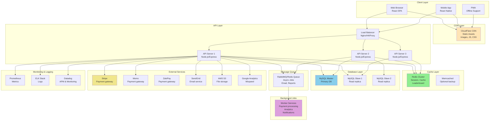

# Technical Architecture & Tech Stack
## Hạt Dẻ Comic Platform

---

## 🏗️ 1. Architecture Overview

### High-Level Architecture



---

## 💻 2. Recommended Tech Stack

### Frontend (Client)

| Layer | Technology | Tính năng | Lý do |
|-------|-----------|---------|--------|
| **Framework** | React 18+ / Next.js 14+ | SPA, SSR | Fast rendering, SEO |
| **Language** | TypeScript | Type safety | Reduce bugs |
| **State Mgmt** | Redux Toolkit / Zustand | Global state | Predictable state |
| **HTTP Client** | Axios / TanStack Query | API calls, caching | Optimistic updates |
| **Styling** | Tailwind CSS + PostCSS | Utility CSS | Fast development |
| **Component Lib** | Radix UI / Headless UI | Accessible components | A11y compliance |
| **Forms** | React Hook Form + Zod | Form validation | Type-safe validation |
| **Animation** | Framer Motion | Smooth animations | Performance optimized |
| **Testing** | Vitest + Testing Library | Unit & integration tests | >80% coverage |
| **Build Tool** | Vite | Fast HMR & bundling | 10x faster than Webpack |
| **Package Mgr** | pnpm | Fast, efficient | Monorepo support |

### Backend (Server)

| Layer | Technology | Tính năng | Lý do |
|-------|-----------|---------|--------|
| **Runtime** | Node.js 20+ LTS | Async, event-driven | JavaScript everywhere |
| **Framework** | Express.js / Fastify | Lightweight, flexible | Fast performance |
| **Language** | TypeScript | Type safety | Production-ready |
| **API Design** | RESTful + GraphQL (optional) | Flexible queries | Reduce over-fetching |
| **Authentication** | JWT + OAuth2.0 | Secure tokens | Stateless, scalable |
| **Database ORM** | Prisma / TypeORM | Type-safe queries | Database abstraction |
| **Validation** | Zod / Joi | Schema validation | Consistent validation |
| **Logging** | Winston / Pino | Structured logs | Easy debugging |
| **Error Handling** | Custom middleware | Global error handler | Consistent responses |
| **Task Scheduler** | node-cron / Bull | Scheduled jobs | Background tasks |
| **File Upload** | Multer / Sharp | Image processing | Optimize images |
| **Rate Limiting** | express-rate-limit | Prevent abuse | DDoS protection |
| **Middleware** | Helmet | Security headers | OWASP compliance |

### Database

| Layer | Technology | Tính năng | Lý do |
|-------|-----------|---------|--------|
| **Primary DB** | MySQL 8.0 / PostgreSQL 15 | ACID, Transactions | Reliable data |
| **Query Builder** | Knex.js / Prisma | Type-safe queries | Easier to write |
| **Cache** | Redis 7+ | Session, Cache | 10K+ QPS support |
| **Message Queue** | RabbitMQ / Redis Queue | Async jobs | Decouple services |
| **Search Engine** | Elasticsearch | Full-text search | Fast searches |
| **Time Series DB** | InfluxDB / TimescaleDB | Analytics data | Metrics & trends |

### DevOps & Infrastructure

| Layer | Technology | Tính năng | Lý do |
|-------|-----------|---------|--------|
| **Containerization** | Docker | Consistent env | Easy deployment |
| **Orchestration** | Kubernetes / Docker Compose | Auto-scaling | High availability |
| **Cloud Platform** | AWS / Google Cloud / Azure | Infrastructure | Pay-as-you-go |
| **CI/CD** | GitHub Actions / GitLab CI | Automated tests & deploy | Fast releases |
| **Monitoring** | Prometheus + Grafana | Metrics visualization | Real-time alerts |
| **Logging** | ELK Stack / Datadog | Centralized logs | Easy troubleshooting |
| **APM** | New Relic / Datadog APM | Performance tracking | Identify bottlenecks |
| **DNS** | CloudFlare | DDoS protection | Global CDN |
| **SSL/TLS** | Let's Encrypt + Certbot | HTTPS encryption | Secure communication |

### Mobile (Optional)

| Layer | Technology | Tính năng | Lý do |
|-------|-----------|---------|--------|
| **Framework** | React Native / Flutter | Cross-platform | iOS + Android |
| **State Mgmt** | Redux / Recoil | Global state | Same as web |
| **HTTP Client** | Axios / React Query | API calls | Consistent |
| **Offline Storage** | AsyncStorage / SQLite | Local storage | Offline reading |
| **Push Notif** | Firebase Cloud Messaging | Real-time alerts | User engagement |
| **Analytics** | Firebase Analytics | User behavior | Metrics & insights |

---

## 🔍 3. Architecture Layers Detail

### 3.1 Frontend Architecture

```
frontend/
├── src/
│   ├── components/          # Reusable components
│   │   ├── Button/
│   │   ├── Modal/
│   │   ├── Header/
│   │   └── ...
│   ├── pages/               # Page components
│   │   ├── Home/
│   │   ├── StoryDetail/
│   │   ├── Read/
│   │   ├── Profile/
│   │   └── ...
│   ├── hooks/               # Custom hooks
│   │   ├── useAuth
│   │   ├── useWallet
│   │   ├── useStory
│   │   └── ...
│   ├── store/               # Redux/Zustand state
│   │   ├── authSlice
│   │   ├── walletSlice
│   │   ├── storySlice
│   │   └── ...
│   ├── api/                 # API client
│   │   ├── auth.api.ts
│   │   ├── story.api.ts
│   │   ├── wallet.api.ts
│   │   └── ...
│   ├── utils/               # Utilities
│   │   ├── constants.ts
│   │   ├── helpers.ts
│   │   ├── validators.ts
│   │   └── ...
│   ├── types/               # TypeScript types
│   │   ├── api.types.ts
│   │   ├── user.types.ts
│   │   ├── story.types.ts
│   │   └── ...
│   ├── styles/              # Global styles
│   │   ├── globals.css
│   │   ├── variables.css
│   │   └── ...
│   ├── App.tsx
│   └── main.tsx
├── public/                  # Static assets
├── .env.local               # Environment variables
├── package.json
├── tsconfig.json
├── vite.config.ts
└── vitest.config.ts
```

### 3.2 Backend Architecture

```
backend/
├── src/
│   ├── controllers/         # Request handlers
│   │   ├── auth.controller.ts
│   │   ├── story.controller.ts
│   │   ├── wallet.controller.ts
│   │   ├── payment.controller.ts
│   │   └── ...
│   ├── services/            # Business logic
│   │   ├── auth.service.ts
│   │   ├── story.service.ts
│   │   ├── wallet.service.ts
│   │   ├── payment.service.ts
│   │   └── ...
│   ├── repositories/        # Data access layer
│   │   ├── user.repository.ts
│   │   ├── story.repository.ts
│   │   ├── chapter.repository.ts
│   │   ├── paywall.repository.ts
│   │   └── ...
│   ├── middleware/          # Express middleware
│   │   ├── auth.middleware.ts
│   │   ├── errorHandler.ts
│   │   ├── rateLimiter.ts
│   │   ├── validation.ts
│   │   └── ...
│   ├── routes/              # API routes
│   │   ├── auth.routes.ts
│   │   ├── story.routes.ts
│   │   ├── user.routes.ts
│   │   ├── payment.routes.ts
│   │   └── ...
│   ├── models/              # Data models (Prisma/TypeORM)
│   │   ├── User.model.ts
│   │   ├── Story.model.ts
│   │   ├── Chapter.model.ts
│   │   └── ...
│   ├── migrations/          # Database migrations
│   │   ├── 001_create_users_table.sql
│   │   ├── 002_create_stories_table.sql
│   │   └── ...
│   ├── jobs/                # Background jobs
│   │   ├── emailQueue.job.ts
│   │   ├── paymentProcessor.job.ts
│   │   ├── dailyReward.job.ts
│   │   └── ...
│   ├── utils/               # Utilities
│   │   ├── logger.ts
│   │   ├── validators.ts
│   │   ├── helpers.ts
│   │   ├── encryption.ts
│   │   └── ...
│   ├── config/              # Configuration
│   │   ├── database.ts
│   │   ├── redis.ts
│   │   ├── env.ts
│   │   └── ...
│   ├── types/               # TypeScript types
│   │   ├── api.types.ts
│   │   ├── models.types.ts
│   │   └── ...
│   ├── app.ts               # Express app setup
│   └── server.ts            # Server entry point
├── prisma/                  # Prisma schema
│   └── schema.prisma
├── tests/                   # Test files
│   ├── unit/
│   ├── integration/
│   └── fixtures/
├── .env                     # Environment variables
├── .env.example
├── package.json
├── tsconfig.json
├── jest.config.js           # Test config
└── docker-compose.yml       # Development compose
```

---

## 🚀 4. Performance Optimization

### Frontend Optimization

```javascript
// Code splitting
const StoryDetail = lazy(() => import('./pages/StoryDetail'));
const Read = lazy(() => import('./pages/Read'));

// Image optimization
<Image
  src={story.cover}
  alt="Story cover"
  width={300}
  height={400}
  priority={false}
  loading="lazy"
  quality={80}
/>

// Bundle analysis
npm run analyze  // Analyze bundle size

// Lazy loading
<InfiniteScroll
  fetchMore={loadMoreStories}
  hasMore={hasMore}
/>

// Compression
// Brotli + gzip in nginx
```

### Backend Optimization

```javascript
// Connection pooling
const pool = mysql.createPool({
  connectionLimit: 10,
  waitForConnections: true,
  queueLimit: 0
});

// Database query optimization
// Use selective fields
SELECT id, title, cover_url FROM stories
  WHERE status = 'published'
  LIMIT 20

// Pagination
const page = req.query.page || 1;
const limit = 20;
const offset = (page - 1) * limit;

// Caching strategy
const cacheKey = `story:${storyId}`;
let story = await redis.get(cacheKey);
if (!story) {
  story = await Story.findById(storyId);
  await redis.setex(cacheKey, 3600, JSON.stringify(story));
}

// Compression
app.use(compression());  // gzip

// Rate limiting
app.use(rateLimit({
  windowMs: 15 * 60 * 1000,
  max: 100
}));
```

### Database Optimization

```sql
-- Use EXPLAIN ANALYZE
EXPLAIN ANALYZE
SELECT s.*, c.id as chapter_id
FROM stories s
LEFT JOIN chapters c ON s.id = c.story_id
WHERE s.status = 'published'
LIMIT 20;

-- Indexing strategy
CREATE INDEX idx_stories_status_published_at 
ON stories(status, published_at DESC);

-- Selective columns
SELECT id, title, view_count, avg_rating
FROM stories
WHERE status = 'published'
ORDER BY published_at DESC
LIMIT 20;
```

---

## 📊 5. Scaling Strategy

### Horizontal Scaling

```yaml
# Docker Compose for local development
version: '3.8'
services:
  api1:
    image: hatde/api:latest
    environment:
      - NODE_ENV=production
      - DATABASE_URL=mysql://user:pass@db:3306/hatde
    ports:
      - "3001:3000"
    depends_on:
      - db
      - redis
      - rabbitmq

  api2:
    image: hatde/api:latest
    environment:
      - NODE_ENV=production
      - DATABASE_URL=mysql://user:pass@db:3306/hatde
    ports:
      - "3002:3000"

  api3:
    image: hatde/api:latest
    ports:
      - "3003:3000"

  nginx:
    image: nginx:latest
    ports:
      - "80:80"
      - "443:443"
    volumes:
      - ./nginx.conf:/etc/nginx/nginx.conf
    depends_on:
      - api1
      - api2
      - api3

  db:
    image: mysql:8.0
    environment:
      - MYSQL_ROOT_PASSWORD=root
      - MYSQL_DATABASE=hatde
    volumes:
      - mysql_data:/var/lib/mysql

  redis:
    image: redis:7-alpine
    ports:
      - "6379:6379"

  rabbitmq:
    image: rabbitmq:3.12-management
    environment:
      - RABBITMQ_DEFAULT_USER=guest
      - RABBITMQ_DEFAULT_PASS=guest
    ports:
      - "5672:5672"
      - "15672:15672"

volumes:
  mysql_data:
```

### Kubernetes Deployment (Production)

```yaml
apiVersion: apps/v1
kind: Deployment
metadata:
  name: hatde-api
spec:
  replicas: 3
  selector:
    matchLabels:
      app: hatde-api
  template:
    metadata:
      labels:
        app: hatde-api
    spec:
      containers:
      - name: api
        image: hatde/api:1.0.0
        ports:
        - containerPort: 3000
        env:
        - name: DATABASE_URL
          valueFrom:
            secretKeyRef:
              name: db-secret
              key: connection-string
        resources:
          requests:
            memory: "256Mi"
            cpu: "250m"
          limits:
            memory: "512Mi"
            cpu: "500m"
        livenessProbe:
          httpGet:
            path: /health
            port: 3000
          initialDelaySeconds: 30
          periodSeconds: 10
        readinessProbe:
          httpGet:
            path: /ready
            port: 3000
          initialDelaySeconds: 5
          periodSeconds: 5
---
apiVersion: v1
kind: Service
metadata:
  name: hatde-api-service
spec:
  selector:
    app: hatde-api
  ports:
  - protocol: TCP
    port: 80
    targetPort: 3000
  type: LoadBalancer
---
apiVersion: autoscaling/v2
kind: HorizontalPodAutoscaler
metadata:
  name: hatde-api-hpa
spec:
  scaleTargetRef:
    apiVersion: apps/v1
    kind: Deployment
    name: hatde-api
  minReplicas: 3
  maxReplicas: 10
  metrics:
  - type: Resource
    resource:
      name: cpu
      target:
        type: Utilization
        averageUtilization: 70
  - type: Resource
    resource:
      name: memory
      target:
        type: Utilization
        averageUtilization: 80
```

---

## 🔐 6. Security Best Practices

### Authentication & Authorization

```javascript
// JWT implementation
const token = jwt.sign(
  { userId: user.id, role: user.role },
  process.env.JWT_SECRET,
  { expiresIn: '24h' }
);

// OAuth2 implementation
app.post('/auth/google', async (req, res) => {
  const ticket = await client.verifyIdToken({
    idToken: req.body.token,
    audience: process.env.GOOGLE_CLIENT_ID
  });
  const { email } = ticket.getPayload();
  // Create or update user
});

// Password hashing
const hashedPassword = await bcrypt.hash(password, 10);
const isPasswordValid = await bcrypt.compare(password, hashedPassword);

// CORS configuration
app.use(cors({
  origin: process.env.FRONTEND_URL,
  credentials: true,
  optionsSuccessStatus: 200
}));
```

### Input Validation & Sanitization

```javascript
// Zod schema validation
const createStorySchema = z.object({
  title: z.string().min(5).max(255),
  description: z.string().max(1000).optional(),
  categoryId: z.number().positive()
});

app.post('/stories', (req, res) => {
  const result = createStorySchema.safeParse(req.body);
  if (!result.success) {
    return res.status(400).json({ errors: result.error });
  }
  // Process validated data
});

// HTML sanitization
const sanitizedContent = DOMPurify.sanitize(userContent, {
  ALLOWED_TAGS: ['p', 'br', 'b', 'i', 'u', 'a'],
  ALLOWED_ATTR: ['href', 'target']
});
```

### Encryption

```javascript
// Environment variables encryption
npm install dotenv-encryption

// Data encryption (sensitive fields)
const crypto = require('crypto');

function encrypt(text) {
  const cipher = crypto.createCipher('aes-256-cbc', process.env.ENCRYPTION_KEY);
  let encrypted = cipher.update(text, 'utf8', 'hex');
  encrypted += cipher.final('hex');
  return encrypted;
}

function decrypt(encrypted) {
  const decipher = crypto.createDecipher('aes-256-cbc', process.env.ENCRYPTION_KEY);
  let decrypted = decipher.update(encrypted, 'hex', 'utf8');
  decrypted += decipher.final('utf8');
  return decrypted;
}
```

---

## 🧪 7. Testing Strategy

### Testing Pyramid

```
        /\
       /  \  Integration Tests (20%)
      /----\
     /      \
    /--------\  Unit Tests (70%)
   /          \
  /____________\ E2E Tests (10%)
```

### Unit Tests Example

```javascript
// services/story.service.test.ts
describe('StoryService', () => {
  let storyService: StoryService;
  let storyRepository: jest.Mocked<StoryRepository>;

  beforeEach(() => {
    storyRepository = mock(StoryRepository);
    storyService = new StoryService(storyRepository);
  });

  it('should get story by id', async () => {
    const storyId = 1;
    const story = { id: 1, title: 'Test Story' };
    
    storyRepository.findById.mockResolvedValue(story);
    
    const result = await storyService.getStory(storyId);
    
    expect(result).toEqual(story);
    expect(storyRepository.findById).toHaveBeenCalledWith(storyId);
  });
});
```

### E2E Tests Example

```javascript
// e2e/reading.e2e.test.ts
describe('Reading Flow', () => {
  it('should read a free chapter', async () => {
    await page.goto('http://localhost:3000/stories/1');
    await page.click('text=Chapter 1');
    
    const chapterContent = await page.textContent('.chapter-content');
    expect(chapterContent).toBeDefined();
  });

  it('should prompt to buy VIP chapter', async () => {
    await page.goto('http://localhost:3000/stories/1');
    await page.click('text=Chapter 10');
    
    const paywall = await page.waitForSelector('.paywall');
    expect(paywall).toBeDefined();
  });
});
```

---

## 📈 8. Monitoring & Analytics

### Key Metrics

```
Performance Metrics:
├── Frontend
│   ├── First Contentful Paint (FCP) < 1.5s
│   ├── Largest Contentful Paint (LCP) < 2.5s
│   ├── Cumulative Layout Shift (CLS) < 0.1
│   └── Time to Interactive (TTI) < 3.5s
├── Backend
│   ├── API response time < 500ms (p99)
│   ├── Error rate < 0.1%
│   ├── Database query time < 100ms (p95)
│   └── Cache hit rate > 80%
└── Infrastructure
    ├── CPU usage < 70%
    ├── Memory usage < 80%
    ├── Disk I/O < 50%
    └── Network latency < 100ms

Business Metrics:
├── DAU growth rate
├── Retention rate (D1, D7, D30)
├── ARPU (Average Revenue Per User)
├── Conversion rate (Freemium → Paid)
└── Churn rate
```

---

## 🚀 9. Deployment Checklist

- [ ] Environment variables configured
- [ ] Database migrations completed
- [ ] Redis cache initialized
- [ ] RabbitMQ queues set up
- [ ] SSL certificates installed
- [ ] CloudFlare CDN configured
- [ ] Monitoring dashboards created
- [ ] Alert rules configured
- [ ] Backup strategy tested
- [ ] Security audit completed
- [ ] Load testing passed (10K concurrent users)
- [ ] Database performance tested
- [ ] API rate limiting verified
- [ ] CORS policy configured correctly
- [ ] Error handling tested
- [ ] Payment gateway tested (sandbox)
- [ ] Email service tested
- [ ] Authentication flows verified
- [ ] Mobile app compatibility tested

